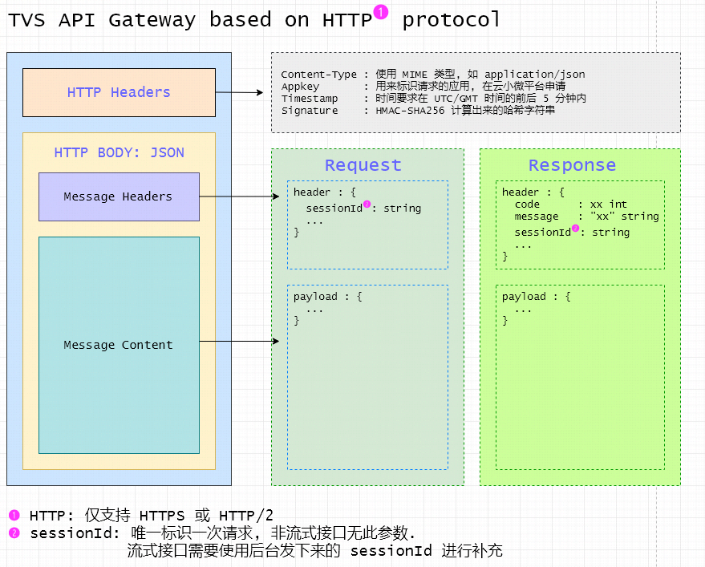

# TVS网关协议
> Created by kangrong on 2019.12.06
## 1. 访问域名

* 正式环境  https://gw.tvs.qq.com
* 体验环境(仅开发调试使用)  https://gwgray.tvs.qq.com
* 测试环境(仅开发调试使用)  https://gw.test.tvs.qq.com/
* 开发环境 (仅开发调试使用) https://gw.dev.tvs.qq.com/

## 2. 访问协议
* https
* http/2


## 3. 协议结构

根据请求的Content-Type来区分，网关支持三种数据封装格式：


- application/json:普通json格式上传，`Content-Type: application/json;charset=utf-8`
- multipart/form-data: 一般是需要传输附件的接口要求，`Content-Type: multipart/form-data; boundary=--this-is-your-boundary`
- Raw格式：只要Content-Type不是`application/json`和`multipart/form-data`，网关认为数据是RAW格式，并且不会进行处理，其HTTP Body协议有业务接口自行设计。


### 3.1 普通application/json格式请求协议



#### 3.1.1 请求协议


**HTTP METHOD**

仅支持POST

**鉴权方式**
见`4. 鉴权方式`章节

**HTTP HEADER**

请求需要填入两个HTTP Header


| Header Name  | 必填 | 说明                                                         | 示例               |
| ------------ | ---- | ------------------------------------------------------------ | ------------------ |
| Content-Type | 是   | 填入`application/json;charset=utf-8`                         |                    |
| DSN          | 否   | 某些业务接口需要上报设备序列号，是否需要填写，由具体接口决定 | 如`12232432523325` |

**HTTP BODY (JSON格式)**

字符编码：UTF-8编码

```
{
  "header"  : { 
  	“qua":{
  	}
  },
  "payload" : { // 业务数据
  }
}
```


| Name  |必填| 类型| 作用|
| ------------ |----| ------------------------------------------------------------ | ------------------------------------------------------------ |
| `header` |是| object  |通用信息
| `header.qua` |否| object|设备端qua信息。是否需要填写，按具体接口要求。
| `header.sessionId` |否| string|sessionId信息。用来串联连续的请求。除非特殊接口（如asr/tts）要求，严禁终端填写。
| `payload`| 是|object|业务自定义object


### 3.2 multipart/form-data格式请求

#### 3.2.1 请求协议

**HTTP METHOD**

仅支持POST

**鉴权方式**
见`4. 鉴权方式`章节

**HTTP HEADER**

与3.1.1的差别在于Content-Type的不同

请求需要填入两个HTTP Header（Content-Type、Authorization），每个字段定义如下：


| Header Name  | 必填 | 说明                                                         | 示例                                             |
| ------------ | ---- | ------------------------------------------------------------ | ------------------------------------------------ |
| Content-Type | 是   | 填入`multipart/form-data; boundary=--this-is-your-boundary`  | `multipart/form-data; boundary=--bsdfsgwewgwegw` |
| DSN          | 否   | 某些业务接口需要上报设备序列号，是否需要填写，由具体接口决定 | 如`12232432523325`                               |

**HTTP BODY **

Http Body为标准的multipart/form-data格式。参照

```
--this-is-a-boundary
Content-Disposition: form-data; name="metadata"
Content-Type: application/json; charset=UTF-8
Content-Length: {{本part长度}}

{{元数据}}
--this-is-a-boundary
Content-Disposition: form-data; name="{{附件名}}"; filename="{{附件文件名}}"
Content-Type: {{标准的MIME格式}}
Content-Length: {{本part长度}}

{{附件内容}}
--this-is-a-boundary
........
--this-is-a-boundary--
```
其中，第一个part的数据，name应该设置为"metadata"，本部分的负载的内容为元数据Json，元数据json定义与3.1.1的HTTP Body格式一致。请参照其定义来封装。除了第一部分是固定的，其他的form-data遵照各个业务接口的定义。

form-data的每一个部分，都有三个头

| Header Name         | 说明         | 示例                                                |
| ------------------- | ------------ | --------------------------------------------------- |
| Content-Type        | 标准MIME格式 | application/json; charset=UTF-8                     |
| Content-Disposition | 标准头       | 至少有name这个参数，`form-data; name="{{附件名}}";` |
| Content-Length      | 内容长度     | 如`21323`                                           |


示例（无签名）：

```http
--this-is-a-boundary
Content-Disposition: form-data; name="metadata"
Content-Type: application/json; charset=UTF-8
Content-Length: 230

{
  "header"  : { 
  	“qua":{
  		"vn":"1.0.0.0"
  	}
  },
  "payload" : { // 业务数据
  }
}

--this-is-a-boundary
Content-Disposition: form-data; name="file"; filename="111222333.png"
Content-Type: image/png
Content-Length: 37264

{{图片数据}}
--this-is-a-boundary--
```

示例（有签名）：

```http
--this-is-a-boundary
Content-Disposition: form-data; name="metadata"
Content-Type: application/json; charset=UTF-8
Signature: 3d1278eb0c1f959abef402b63aff8e836ae28fc896b58603c67b36e098d339cd
Content-Length: 230

{
  "header"  : { 
  	“qua":{
  		"vn":"1.0.0.0"
  	}
  },
  "payload" : { // 业务数据
  }
}

--this-is-a-boundary
Content-Disposition: form-data; name="file"; filename="111222333.png"
Content-Type: image/png
Signature: 3d1278eb0c1f959abef402b63aff8e836ae28fc896b58603c67b36e098d339cd
Content-Length: 37264

{{图片数据}}
--this-is-a-boundary--
```


### 3.3 Raw格式请求

#### 3.3.1 请求协议

**HTTP METHOD**

仅支持POST

**鉴权方式**
见`4. 鉴权方式`章节

**HTTP HEADER**

与3.1.1的差别在于Content-Type的不同


| Header Name  | 必填 | 说明                                                         | 示例               |
| ------------ | ---- | ------------------------------------------------------------ | ------------------ |
| Content-Type | 是   | 按照接口需求填入                                             | `multipart/xxx     |
| DSN          | 否   | 某些业务接口需要上报设备序列号，是否需要填写，由具体接口决定 | 如`12232432523325` |

**HTTP BODY **

Http Body为标准的multipart/form-data格式。参照


### 3.4 回包协议

**HTTP STATUS**

如果请求正常到达云小微服务，云小微服务会返回`200`

**HTTP HEADER**

标准 HTTP HEADER

**HTTP BODY (JSON格式)**

字符编码：UTF-8编码

```
{
  "header"  : {
    "code"      : xx, // int 类型，范围见下节
    "message"   : ""  // string, 如果出现错误, 会在这里描述
    "sessionId" : ""  // string, 唯一标识这次请求&响应, 不涉及业务, 可用于排查问题
  },
  "payload" : { // 业务数据。不同URL将会不同
  }
}
```
#### 3.3.1 HTTP BODY header.code 通用返回码

header.code返回的错误码定义遵照HTTP Status定义方式。

|  Code   | 说明                                                         |
| :-----: | :----------------------------------------------------------- |
| 200-299 | 成功                                                         |
| 400-499 | 终端请求有问题，包括参数不全，签名不对等，详细原因见返回的message |
| 500-599 | 后台处理有问题，详细原因见返回的message                      |


## 4. 鉴权方式

根据不同业务的安全级别，网关支持三种鉴权方式。不同的业务会选择不同的鉴权方式，请遵照业务接口文档的定义。

安全级别`4.1 Appkey鉴权`<`4.2 签名鉴权`<`4.3 Authorization鉴权`

接口如果要求`Appkey鉴权`，开发者可以使用Appkey鉴权、签名鉴权、 Authorization鉴权方式请求
接口如果要求`签名鉴权`，开发者可以使用签名鉴权、 Authorization鉴权方式请求，不能使用`Appkey鉴权`方式请求。
接口如果要求`Authorization鉴权`，开发者可以使用 Authorization鉴权，不能使用`Appkey鉴权`和`签名鉴权`方式请求。


### 4.1 Appkey鉴权

涉及的HTTP Header


| Header Name | 说明                                 | 示例                         |
| ----------- | ------------------------------------ | ---------------------------- |
| Appkey      | 用来标识请求的应用, 在云小微平台申请 | `2393i239238432353252sdmfsd` |

开发者只需要将在云小微申请的APP填入HTTP Header中，就可以通过云小微的鉴权访问接口。

### 4.2 签名鉴权

根据不同的请求协议， 分为两种签名方法。

#### 4.2.1 普通请求签名
当请求协议为`3.1  普通application/json格式请求协议`和`3.3 Raw格式请求`时，适用于本方法进行签名

本方法需要终端请求时在HTTP Header多添加四个字段用来传递签名信息。如下

| Header Name | 说明                                                         | 示例                                                         |
| ----------- | ------------------------------------------------------------ | ------------------------------------------------------------ |
| Appkey      | 用来标识请求的应用, 在云小微平台申请                         | `2393i239238432353252sdmfsd`                                 |
| Timestamp   | 签名时使用的时间戳 ，单位：秒, 时间要求在 UTC/GMT 零时区时间的前后 5 分钟内 | 如`1575651553`                                               |
| Signature   | 签名串。                                                     | 如`3d1278eb0c1f959abef402b63aff8e836ae28fc896b58603c67b36e098d339cd` |
| Timestamp   | 签名时使用的时间戳, 时间要求在 UTC/GMT 时间的前后 5 分钟内   | 如`1575651553`                                               |


**签名规则**

签名涉及的参数:
Timestamp: 时间戳，时间要求在 UTC/GMT 时间的前后 5 分钟内, 单位:秒(unix timestamp)
AccessToken: 开放平台申请的应用的AccessToken。
Http-Body: HTTP请求体

以签名下面这个请求Http-Body为例。
```
{
    "header": 
    {
    },
    "payload": 
    {
        "query": "景区的投诉"
    }
}
```

首先获取当前时间戳(Timestamp)为`1575651553`，
拼接Http-Body与Timestamp，记为`SigningContent`

```
{
    "header": 
    {
    },
    "payload": 
    {
        "query": "景区的投诉"
    }
}1575651553
```
假如AccessToken为`myAccessToken`

以AccessToken为密钥，以`SigningContent`为内容，计算HMAC-SHA256的结果。

signature = HMAC-SHA256(SigningContent, AccessToken)，就得到签名结果。


**注:**

* ***AccessToken 为签名密钥, 请不要泄露***

* `signature` 为 `HMAC-SHA256` 计算出来的16进制字符串
* 在线的 HMAC-SHA256 计算网站 [传送门](https://tool.oschina.net/encrypt?type=2)
* 拼接过程为字符串连接操作, 中间无任何符号

**Q&A**
假如后台返回签名出现问题，请按照以下步骤检查

- Appkey，AccessToken应该为云小微开发平台申请、并且发布过的，否则会校验不过。

- 如果云小微开放平台申请的应用，刚刚发布，请过五分钟再请求。

- 检查签名用的HMAC_SHA256密钥是否为AccessToken。

- 检查签名用的body与发送请求的body是否一致。

- 如果是手写的http协议请求，请务必保证http header有content-length，并且content-length是正确的。

- 签名时，是否有拼接body和时间戳。按照规则，需要拼接。

- 时间戳仅支持UTC时间，并且，与真实时间差距不能超过五分钟，否则会返回签名过期的错误。


#### 4.2.2 multipart/form-data签名

当Content-Type为`multipart/form-data`时，适用于本签名方法


本方法需要终端请求时在Http Header添加三个字段，在part header添加一个字段用来传递签名信息。


在HTTP头的

| HTTP Header Name | 说明                                                         | 示例                         |
| ---------------- | ------------------------------------------------------------ | ---------------------------- |
| Appkey           | 用来标识请求的应用, 在云小微平台申请                         | `2393i239238432353252sdmfsd` |
| Timestamp        | 签名时使用的时间戳, 单位：秒, 时间要求在 UTC/GMT 零时区时间的前后 5 分钟内 | 如`1575651553`               |

在Part中添加如下Header

| Part Header Name | 说明     | 示例                                                         |
| ---------------- | -------- | ------------------------------------------------------------ |
| Signature        | 签名串。 | 如`3d1278eb0c1f959abef402b63aff8e836ae28fc896b58603c67b36e098d339cd` |

形象化展示，最终请求签名类似下面的格式。

```
POST /test HTTP1.1
Content-Type: multipart/form-data; boundary=--this-is-your-boundary
Appkey: thisismyappkey
Timestamp: 1575651553
DSN:2223523523
Content-Length:222323

--this-is-a-boundary
Content-Disposition: form-data; name="metadata"
Content-Type: application/json; charset=UTF-8
Signature: 3d1278eb0c1f959abef402b63aff8e836ae28fc896b58603c67b36e098d339cd
Content-Length: 230

{
  "header"  : { 
  	“qua":{
  		"vn":"1.0.0.0"
  	}
  },
  "payload" : { // 业务数据
  }
}

--this-is-a-boundary
Content-Disposition: form-data; name="file"; filename="111222333.png"
Content-Type: image/png
Signature: 3d1278eb0c1f959abef402b63aff8e836ae28fc896b58603c67b36e098d339cd
Content-Length: 37264

{{图片数据}}
--this-is-a-boundary--
```


签名方法与4.2.1签名有少许不同：multipart/form-data要求对每个part都要进行签名。

**签名规则**

签名涉及的参数:

Part-Body: multipart/form-data的每个part

Timestamp: 时间戳，时间要求在 UTC/GMT 时间的前后 5 分钟内, 单位:秒(unix timestamp)。同一个请求的所有Part-Body的签名应使用同一个Timestamp。
AccessToken: 开放平台申请的应用的AccessToken。
以签名下面这个请求multipart/form-data为例。

```


--this-is-a-boundary
Content-Disposition: form-data; name="metadata"
Content-Type: application/json; charset=UTF-8
Content-Length: 230


{
  "header"  : { 
  	“qua":{
  		"vn":"1.0.0.0"
  	}
  },
  "payload" : { // 业务数据
  }
}

--this-is-a-boundary
Content-Disposition: form-data; name="file"; filename="111222333.png"
Content-Type: image/png
Content-Length: 37264

{{图片数据}}
--this-is-a-boundary--
```


签名步骤：

a. 首先获取当前时间戳(Timestamp)，本时间戳，将会应用每个part的签名。

b. 对每一个part执行如下步骤进行签名	

- 将part body与Timestamp进行拼接，记为`SigningContent`

- 以AccessToken为密钥，以`SigningContent`为内容，计算HMAC-SHA256的结果。

    signature = HMAC-SHA256(SigningContent, AccessToken)，就得到签名结果。

- signature应放到当前签名part的header中。


最终结果为


```
--this-is-a-boundary
Content-Disposition: form-data; name="metadata"
Content-Type: application/json; charset=UTF-8
Signature: demo3d1278eb0c1f959abef402b63aff8e836ae28fc896b58603c67b36e098d
Content-Length: 230

{
  "header"  : { 
  	“qua":{
  		"vn":"1.0.0.0"
  	}
  },
  "payload" : { // 业务数据
  }
}

--this-is-a-boundary
Content-Disposition: form-data; name="file"; filename="111222333.png"
Content-Type: image/png
Signature: demo3d1278eb0c1f959abef402b63aff8e836ae28fc896b58603c67b36e098d
Content-Length: 37264

{{图片数据}}
--this-is-a-boundary--
```


**注:**

* ***AccessToken 为签名密钥, 请不要泄露***

* `signature` 为 `HMAC-SHA256` 计算出来的16进制字符串
* 在线的 HMAC-SHA256 计算网站 [传送门](https://tool.oschina.net/encrypt?type=2)
* 拼接过程为字符串连接操作, 中间无任何符号


###  4.3 Authorization鉴权

涉及的HTTP Header

| Header Name   | 说明                          | 示例                                                |
| ------------- | ----------------------------- | --------------------------------------------------- |
| Authorization | 格式为`Bearer 云小微访问票据` | `Bearer BACKEND-ENCRYPT:1000,Mix3eDI0N2ExNmJmNzhhO` |

云小微访问票据，可以根据https://dingdang.qq.com/doc/page/365 中文档说明来获得。访问网关系列接口，网关校验通过后才能正常调用。


## 5. 示例代码（python代码）

```python
# -*- coding: UTF-8 -*-
import datetime, hashlib, hmac
import requests # Command to install: `pip install request`
import json, sys, time

# 腾讯云小微提供的appkey/accessToken，请填入自己的
appKey = "xxxx";
accessToken = b"xxxx";

# ***** Task 1: 拼接请求数据和时间戳 *****

## 获取请求数据(也就是HTTP请求的Body)
postData = '''
{
    "header": 
    {
        "businessName":"MyServerName"
    },
    "payload": 
    {
    }
}
'''

jsonReq = json.loads(postData);
jsonReq["payload"]["query"] = "景区的投诉";

httpBody = json.dumps(jsonReq)

## 获得Unix时间戳
credentialDate = (int(time.time()))   

print(credentialDate)
## 拼接数据
signingContent = httpBody + str(credentialDate)

# ***** Task 2: 获取Signature签名 *****
signature = hmac.new(accessToken, signingContent.encode('utf-8'), hashlib.sha256).hexdigest()

# ***** Task 3: 在HTTP请求头中带上签名信息

headers = {'Content-Type': 'application/json', 
           'Appkey': appKey,
           'Timestamp': str(credentialDate),
           'Signature': signature
           }

# **** Send the request *****
# 正式环境URL
#requestUrl = 'https://gw.tvs.qq.com/cloud/travel-yunnan/complaints-classification'

print ('Begin request...')
print ('Request Url = ' + requestUrl)

session = requests.session()
session.headers.update(headers)
print ('Request Headers =' + str(session.headers))
print ('Request Body =' + httpBody)

reqTime = time.time();
r = session.post(requestUrl, data = httpBody.encode('utf-8'))
respTime = time.time();


print ('Response...')
print ("HTTP Status Code:%d" % r.status_code, "cost:%f(ms)" %((respTime - reqTime) * 1000));
print (r.text)

```

## Q&A

如果遇到问题，试运行下demo。如果demo能跑通，自己写的代码跑不通，请先自查问题。
